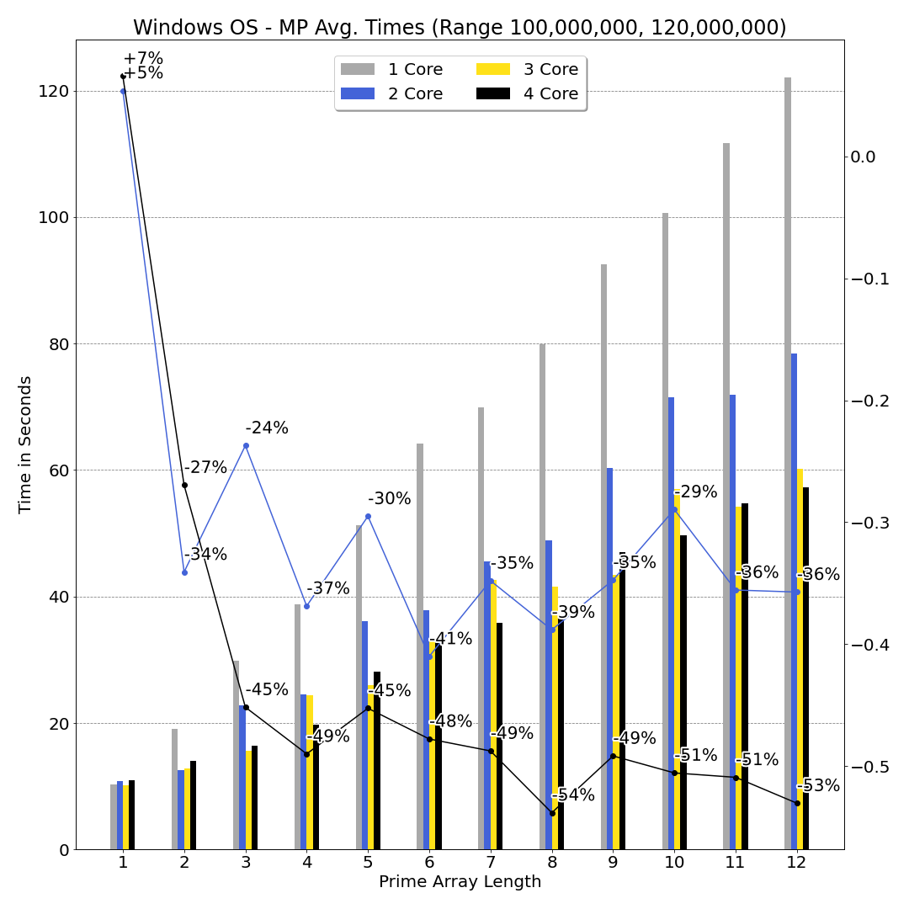
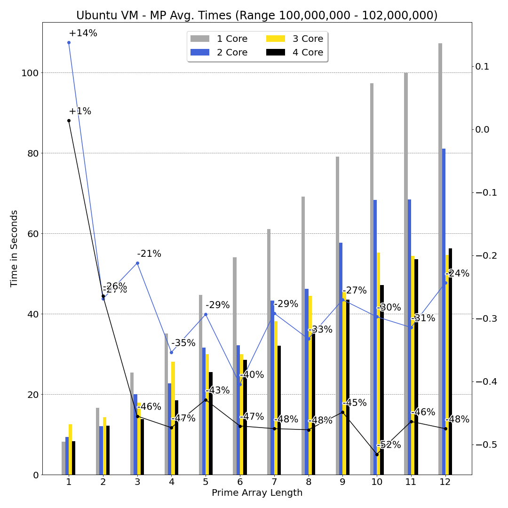

# Multiprocessing

### An analysis of Python’s multiprocessing package.

## 0.1 Prime Number Calculation - QuadCore Analysis

My PC (Surface Book 2) has the following CPU: Intel(R) Core(TM) i7-8650U CPU @ 1.90GHz 2.11 GHz. This CPU has 4
cores and 8 logical processors - Python’s multiprocessing can only effectively utilise the physical cores so for the analysis below
we will focus on 4 cores. This is because my CPU uses Hyper-Threading, which is a hardware innovation that allows more
than one thread to run on each core. This enables two execution contents per core, which is the reason why when I run
print(multiprocessing.cpu_count())8 cores are returned. In actual fact, my CPU only has 4 physical cores but because
Hyper-Threading is active, 8 is returned. In the multiprocessing package’s documentation, we can see that it sidesteps Python’s
GIL (Global Interpreter Lock) by using multiple separate Python processes which then each are assigned by the operating system
to available cores rather than threads as Python cannot effectively utilise threading.

Assumptions: Before doing the following analysis, I expected 2 cores to decrease the running time by a factor of 2 over 1 core
and for 4 cores to decrease the running time by a factor of 4 over 1 core. As we will see below, this was not the case.

The speedup from using more cores is also directly related to the input length in this case. If the input length is only 1 (e.g. one
prime number to compute), we cannot parallelise this task so at most one core would be most effective. In the case of an input
length of 4 prime numbers, we do have the opportunity to parallelise this task by a factor of 4, as we can simultaneously calculate
one prime number on each of 4 cores respectively - with an effective speedup factor of 4.

Amdahl’s Law is also a factor that should be considered here. In the case of this program, which is embarrassingly parallel, the
value of p will be equal to 1 and the value of n will be equal to the number of cores. This results in the following calculation -
effectively telling us what we would’ve expected from increasing the number of cores - that the speedup will be linearly related to
the number of cores.

Amdahl’s Law is more applicable to a problem which has a combination of both Parallelisable and Serial tasks: for instance, if we
were to first run the prime number function on the same prime number as in the input data input data outside of the multiprocessing
pool, before entering the multiprocessing pool to calculate input data of length 4, we would say that^15 of the task is Serial (first
running of prime number function outside of pool) and the remaining^45 is Parallelisable (p).

Analysis: Please see the graphs on the next page. For my analysis, I have used one very large prime number (9 digits) and tried
out lists of size 1 up to 12. I tested this over a number of iterations and averaged the resulting running times to increase the
accuracy. The lines on the chart below show the percentage difference in running time between that number of cores and one core,
where the colors correspond to the number of cores being used (i.e. Blue = 2 cores, Black = 4 cores).

2 cores: With only one element, the running time is 5% greater than it would have been if only one core was being used. This
would most likely be due to the overhead of the multiprocessing Pool starting an extra process. We immediately see the drop in
running time when looking at a list of length 2, with a decrease of 34% between using 1 core and 2 cores for the same task. The
differences between using one and two cores after this follows a zig-zag pattern as we would expect. This occurs because with a
list of length 3, using 2 cores is no longer quite as efficient as it was when the list length was evenly divisible by 2 - for the third
element to be processed, one of the first two processes must first finish essentially adding on the time it takes to run the function
to the end of processing a list of length 2. We see this in the percentage decrease as it rises by 10%. Following this, the relative
time it takes drops again, as list length of 4 is evenly divisible by 2. This pattern will smooth out as the input size grows.

As we look at the data, one issue is very apparent: the decrease in running time between one core and two cores on an evenly
divisible by 2 list length does not decrease the running time by a factor of 2 as we previously expected. A number of external
factors may account for this result - there is increased overhead when starting a new process using multiprocessing in Python as
it creates a new Python interpreter instance - this in itself will add on time when using 2 cores vs 1 core, we can see this when
looking at list length of 1, where 2 cores takes 5% longer than 1 core for the same task, although I do not expect this to be the
main cause of the results here as time to calculate one prime number is far greater than the initialisation time of a new process.

We must also consider that the Python processes are not the only processes running on my PC while doing this analysis. For
instance, Windows Operating System itself will always require a certain amount of processing time to handle the graphical user
interface, memory management etc. On top of Windows Operating system, there is also the various programs that are running
in the foreground and background on my PC, such as the Web Browser I used to access the Jupyter Notebook, the terminal I
used to run Jupyter Notebook (Windows Command Prompt) and background processes such as messaging applications (Discord,
Facebook etc.).

For the above reasons, we do not see what we would expect from the results. We can quantify the speedup here - as input size
increases effect of the input size not being evenly divisible by 2 becomes less apparent (see length 11), and we can safely say that
for a large enough input size on my PC, using 2 cores over 1 core for this task will decrease the running time by 36%. This is a
14 percentage point difference to what we would have expected.

4 cores:Again, looking at 4 cores in comparison to 2 and 1, we do not see the expected decrease in running time. By following
the black line on the plot we can see that the running time decreases down to a steady level of approx. -50% decrease, meaning
the use of 4 cores speeds up the calculations by a factor of 2. This is the decrease we would expect from using 2 cores but it is
only seen when using 4. I suspect the reasons for this occurrence are similar to why the results were not as expected above: other
processes running on the CPU.

Conclusion:This analysis has shown that it is difficult to quantify the actual speedup we see from adding more cores in practice.
While we can expect a theoretical increase based on sound logic, when implementing actual code the result can vary quite a lot.
It is still interesting to note the speedup we do see from adding more cores to the task - for this task, which is very parallelisable,
it is quite apparent that more cores is decreasing the running time.

## 0.2 Virtual Machine: Ubuntu

Running the same functions on Ubuntu on Virtual Box yielded interesting results. Firstly, we can see that for the shorter list
lengths (up to length of 9), the virtual machine completed the tasks faster than Windows at the same tasks. This is due to Intel
Virtualisation Technology, which enables virtual machines, like Ubuntu on Virtual Box, to run very close to how they would if
they were running directly on the hardware (i.e. bare metal). The performance benefit we see here can then be attributed to
Python in general running faster on Linux than on Windows - from anecdotal reports online this seems to generally be true, and
could be accounted for because on Linux, the C compiler Python uses is compiled in (GCC) uses Computed Gotos to optimise the
interpreter’s inner loop.

Assumptions: Before doing the above analysis, I would have assumed Ubuntu would have performed measurably worse than
Windows at this task. I was unaware of Intel Virtualisation and presumed operations would have a much less direct route to be
running on the CPU. Knowing now that this technology exists, I would assume the same time increases as in my assumptions
above for Windows OS, i.e. 2 cores halving the running time vs 1 core.

2 cores: In the case of 2 cores when the array size is only one, we see 14% increase in the running time. This is much larger than
the 5% increase we saw on Windows above for the same scenario. I would suspect that the cost of creating new processes may be
more expensive on a virtual machine than on Windows. It may also be the case that because the Virtual Machine calculated the
prime numbers faster that this has skewed our results. We also see a very similar zig-zag pattern here as the array length increases.
We can quantify the speedup seen here as approx. 25% given a large enough input size.

4 cores: 4 cores see a similar trend to Windows OS also. We can quantify the speedup here as being approx. 48% over using
one core.

Final Conclusion: From my analysis above, it is clear to see that my PC does not perform as we would’ve expected for this
parallelisation task. While we do see a measurable speedup on both Windows OS and the Ubuntu VM, it is nowhere near the
assumptions that had previously been made. A number of factors - mainly background and foreground processes on Windows can
be attributed to why we do not see the intended speedup. Other possibilities include the Turbo Frequency of my PC being 7%
less when using over 2 cores. Overall, this assignment has taught me the benefit of using multiprocessing when doing independent
tasks. Outside of this assignment, I have implemented multiprocessing when training a number of machine learning models, to
speedup the training time - which worked effectively and gave an approximate 50% decrease in training time when using 4 cores
over without using multiprocessing at all (1 core), which aligns with the results above.
